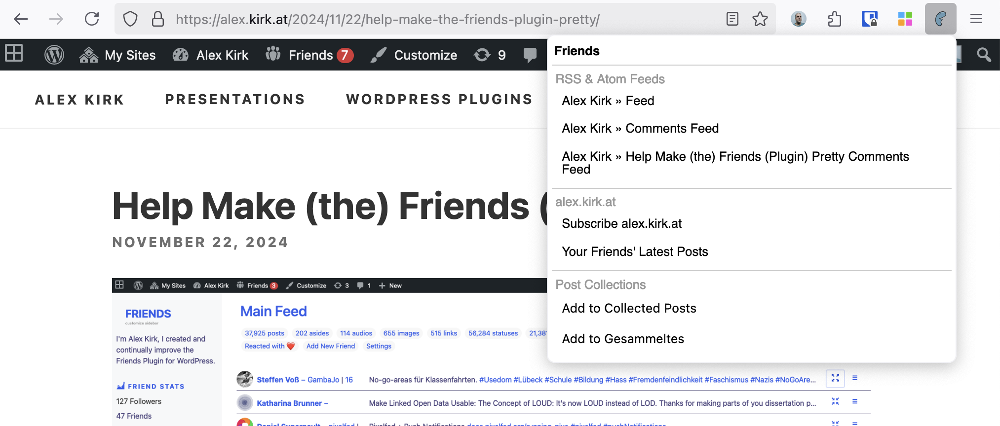
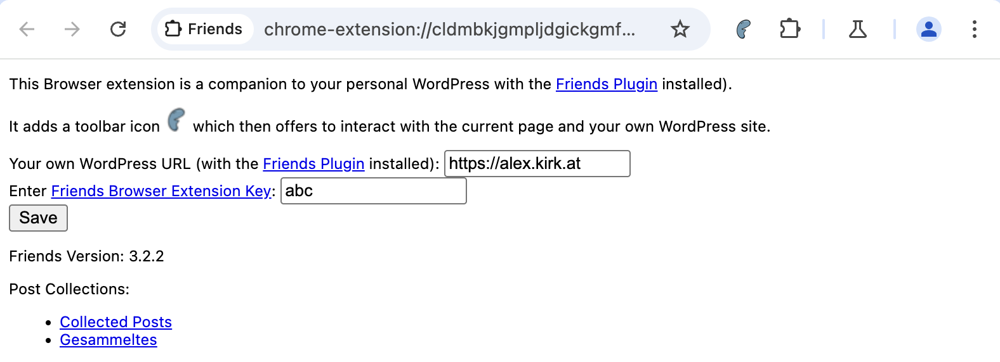

# Friends Browser Extension

The extension works in Firefox and Chrome and acts as a companion to the  [Friends Plugin](https://wordpress.org/plugins/friends/) for WordPress.

It allows quick insight into:
- The feeds offered by the current page as `<link rel="alternative" />`.
- Other profiles of the user shown as `<link rel="me" />`.

After you have set your WordPress URL, it can also:
- Add the current page as a friend.

If you are on a Mastodon instance, it can also:
- Follow the user on Mastodon.
- Reply to the currently viewed toot.

If you enter the browser extension key that you can find on your Friends page (link in the extension), you can:
- Submit the current page to a page collection.





## Privacy

This extension does not collect any data on behalf of the developer. All data (your WordPress site URL and API key) is stored locally in your browser and only sent to your own self-hosted WordPress instance. The `data_collection_permissions: []` in the manifest reflects this.

## Testing on Firefox Mobile

Follow a guide like [Debugging Firefox on Android](https://chenhuijing.com/blog/debugging-firefox-on-android/), get your device id with `adb devices -l`, go to `about:debugging` in Firefox, enable remote debugging, and run the extension with:

```
web-ext run -t firefox-android --adb-device <deviceid> --firefox-apk org.mozilla.firefox
```
