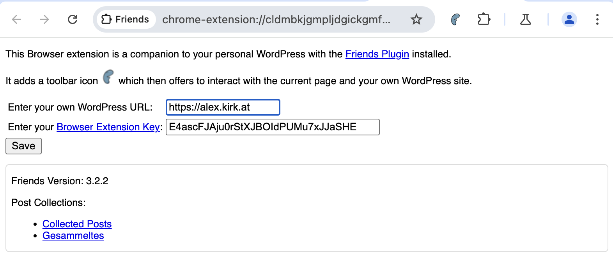

# Friends Browser Extension

The extension works in Firefox and Chrome and acts as a companion to the  [Friends Plugin](https://wordpress.org/plugins/friends/) for WordPress.

It allows quick insight into:
- The feeds offered by the current page as `<link rel="alternative" />`.
- Other profiles of the user shown as `<link rel="me" />`.

After you have set your WordPress URL, it can also:
- Add the current page as a friend.

If you are on a Mastodon instance, it can also:
- Follow the user on Mastodon.
- Reply to the currently viewed toot.

If you enter the browser extension key that you can find on your Friends page (link in the extension), you can:
- Submit the current page to a page collection.

